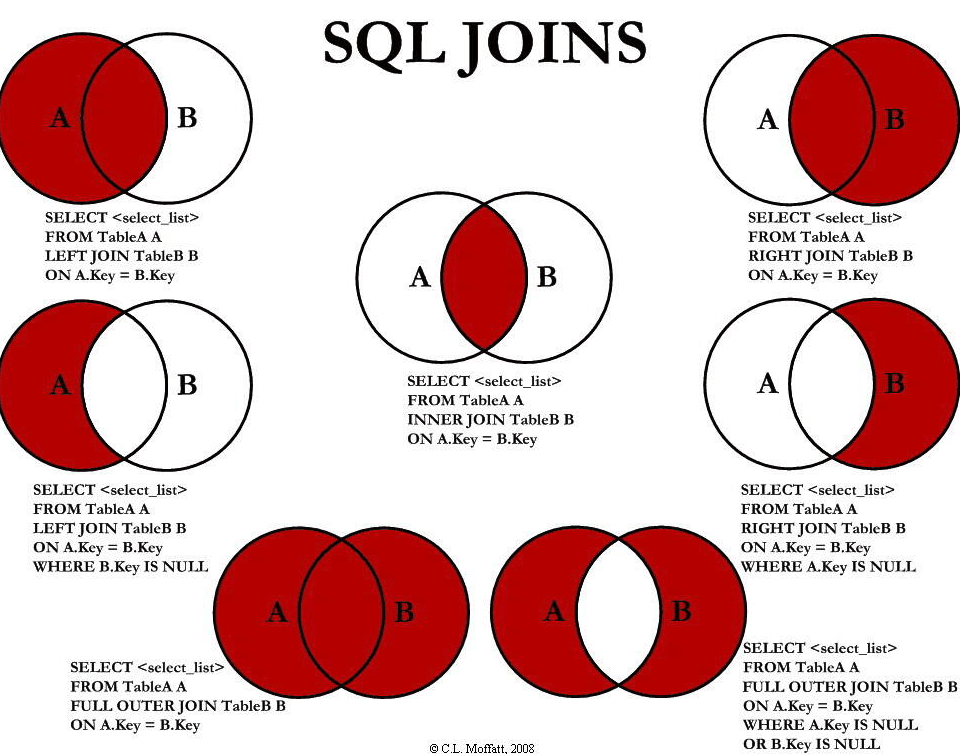

# 说明

> 这里属于SQL 的高级用法，里面有很多内容 都是些高级的内容，提供你学习和研究

## SELECT TOP

> 对于 这个语法(子句对于拥有数千条记录的大型表来说，是非常有用的), 主要是 获取 规定的多少条数据，每家的实现是不一样的，我们以MYSQL 和 Oracle 举例子

1. mysql & Oracle template

```sql
SELECT column_name(s)
FROM table_name
LIMIT number;

SELECT column_name(s)
FROM table_name
WHERE ROWNUM <= number;
```

2. 例子 Mysql

```sql
--  选取头两条
SELECT * FROM websites 
  LIMIT 2;
```

## LIKE

> LIKE 操作符用于在 WHERE 子句中搜索列中的指定模式。具备特殊的 语法

1. template

```sql
SELECT column_name(s)
FROM table_name
WHERE column_name LIKE pattern; 
```

2. 例子

```sql
-- 以某字母开头
SELECT * FROM websites
 WHERE name LIKE 'G%';
 
-- 以某字母结尾
SELECT * FROM websites
 WHERE name LIKE '%e'
 
-- 中间含某字母
SELECT * FROM websites
 WHERE name LIKE '%oo%'

-- 取反
SELECT * FROM websites
 WHERE name NOT LIKE 'G%'

```

3. 具体的说明

| SQL      | Description |
| ----------- | ----------- |
| %M      | 以M结尾的数据 |
| M%      | 为能配符，正则表达式，表示的意思为模糊查询信息为 M 开头的 |
| %M%      | 表示查询包含M的所有内容。 |
| _M_      | 三位且中间字母是a的 |
| _M      | 两位 结尾是M |
| M_      | 两位 开头是M |

提一个问题如果是需要 _% 是数据本身的内容如何转义呢？

```sql
SELECT * FROM websites WHERE name LIKE 'g\_%' ESCAPE '\'
SELECT * FROM websites WHERE name LIKE 'g\_%'
-- 如果你的name = ‘g_'就能被查出来 
-- 后者可以查出g123,g123123,gabs
```

4. 使用 SQL [charlist] 通配符

> REGEXP 或 NOT REGEXP ,有关更多的 通配符 例子 看这里的 笔记📒 (<https://www.runoob.com/sql/sql-wildcards.html>) 🤔或者问一下 GPT

这个主要是可以支持正则;
下面的 SQL 语句选取 name 以 "G" 开始，然后是一个任意字符，然后是 "o"，然后是一个任意字符，然后是 "le" 的所有网站：

```sql
--  G | f | s 开头的
SELECT * FROM websites
  WHERE name REGEXP '^[Gfs]';

-- A -> H 的
SELECT * FROM websites
  WHERE name REGEXP '^[A-H]';

-- name 不以 A -> H 开头的
SELECT * FROM websites
  WHERE name REGEXP '^[^A-H]';
```

## IN

1. template

```sql
SELECT colum1, colum2,.... FROM table_name
  WHERE colum IN (value1, value2, ...);
```

2. 例子

> 找到 Google ｜ baidu

```sql
SELECT * FROM websites
  WHERE name IN ('Google','淘宝');
```

3. 具体的说明

> 没什么需要特别说的 非常的简单

## BETWEEN
>
> 意味 在什么之间 的值
> 注意 在不同的数据库系统中 between 操作符不一样哈，你最好去查一下

1. template

```sql
SELECT colum1,colum2,... FROM table_name
  WHERE colum BETWEEN value1 AND value2;
```

2. 例子

```sql
-- 选一个 alexa 在10-20 之间的
SELECT * FROM websites
  WHERE alexa BETWEEN 10 AND 20

-- 取反
SELECT * FROM websites
  WHERE alexa  NOT BETWEEN 10 AND 20

-- 结合其它的sql
SELECT * FROM websites
  WHERE (alexa NOT BETWEEN 1 AND 200)
  AND country NOT IN('USA','CN');

-- 查Date in 2016-05-10 -> 2016-05-14
SELECT * FROM access_log
  WHERE date BETWEEN '2016-05-10' AND '2016-05-14'
```

3. 具体的说明

## 别名
>
> 创建别名是为了让列名称的可读性更强。

1. template

```sql
SELECT colum_name AS alisa_name FROM table_name;
```

2. 例子

```sql
-- 字段别名
-- 简单例子
SELECT name as n, country as c FROM websites

-- 把几个字段拼接在一起并且重新命名 CONCAT 函数
SELECT name, CONCAT(url, '--->', alexa, '--->', country) FROM websites;

-- 表别名+复炸查询
SELECT w.name,w.url, a.count,a.date  FROM websites AS w, access_log as a
  WHERE a.site_id=w.id AND w.name="菜鸟教程"
```

3. 具体的说明

## 连接JOIN(SQL JOIN)
>
> 从这里开始我们将会使用 关系型数据库的核心能力 关系！ 一张图走天下


1. template

```sql
SELECT column1, column2, ...
FROM table1
JOIN table2 ON condition;
```

主要表达的意思是 把tab1 和 tab2 以 condition 条件 连接在一起，再从中后去数据

2. 例子

> 注意我们目前练习的表是有联系的哈，"Websites" 表中的 "id" 列指向 "access_log" 表中的字段 "site_id"。上面这两个表是通过 "site_id" 列联系起来的。

```sql
-- 连接一下 条件是 
-- "Websites" 表中的 "id" 列指向 "access_log" 表中的字段 "site_id"。上面这两个表是通过 "site_id" 列联系起来的。
SELECT w.name,w.url, a.date FROM websites AS w INNER JOIN access_log AS a
  ON w.id=a.site_id;
```

3. 具体的说明

| SQL      | Description |
| ----------- | ----------- |
| INNER JOIN      | 如果表中有至少一个匹配，则返回行 |
| LEFT JOIN      | 即使右表中没有匹配，也从左表返回所有的行 |
| RIGHT JOIN      | 即使左表中没有匹配，也从右表返回所有的行 |
| FULL JOIN      | 只要其中一个表中存在匹配，则返回行 |
| _M      | 两位 结尾是M |
| M_      | 两位 开头是M |

特别是说明：_MySQL 暂不支持 FULL JOIN, 要实现完全外部链接需要额外处理。-- MySQL实现完全外部链接，要使用 UNION 将一个左链接、和一个右链接去重合并。_

```sql
SELECT a.*,b.*
FROM 表1 a LEFT JOIN 表2 b
ON a.unit_NO = b.unit_NO

UNION

SELECT a.*,b.*
FROM 表1 a RIGHT JOIN 表2 b
ON a.unit_NO = b.unit_NO;
```

## INNER JOIN (JOIN)
>
> 又别名位 JOIN, 要求区交集，至少存在一个匹配时才返回

1. template

```sql
SELECT column_name(s)
FROM table1
INNER JOIN table2
ON table1.column_name=table2.column_name;
```

2. 例子

```sql
SELECT websites.name,
  access_log.count,
  access_log.date
FROM websites
  INNER JOIN access_log ON websites.id = access_log.site_id
ORDER BY access_log.count;
```

3. 具体的说明

注意哈：在使用 join 时，on 和 where 条件的区别如下：

 1、 on 条件是在生成临时表时使用的条件，它不管 on 中的条件是否为真，都会返回左边表中的记录。
 2、 where 条件是在临时表生成好后，再对临时表进行过滤的条件。这时已经没有 left join 的含义（必须返回左边表的记录）了，条件不为真的就全部过滤掉。

## LEFT JOIN
>
> LEFT JOIN 关键字从左表（table1）返回所有的行，即使右表（table2）中没有匹配。如果右表中没有匹配，则结果为 NULL。

1. template

```sql
SELECT column_name(s)
FROM table1
LEFT JOIN table2
ON table1.column_name=table2.column_name;
或：

SELECT column_name(s)
FROM table1
LEFT OUTER JOIN table2
ON table1.column_name=table2.column_name;
```

2. 例子

```sql
SELECT * 
  FROM websites LEFT JOIN access_log 
  ON websites.id = access_log.site_id
  ORDER BY access_log.count DESC;
-- 可以看到就算7 不在 access_log（右表上 ，也能全部把左边的left 的表 全带出来)

```

3. 具体的说明

## RIGHT JOIN
>
> 这个和前面那个是反着来的

1. template
2. 例子
3. 具体的说明

## FULL JOIN

1. template
2. 例子
3. 具体的说明

## UNION

1. template
2. 例子
3. 具体的说明

## SELECT INTO

1. template
2. 例子
3. 具体的说明

## INSERT INTO SELECT

1. template
2. 例子
3. 具体的说明

## CREATE DATABASE

1. template
2. 例子
3. 具体的说明

## CREATE TABLE

1. template
2. 例子
3. 具体的说明

## 约束

1. template
2. 例子
3. 具体的说明

## NOT NULL

1. template
2. 例子
3. 具体的说明

## UNIQUE

1. template
2. 例子
3. 具体的说明

## PRIMARY KEY

1. template
2. 例子
3. 具体的说明

## FOREIGN KEY

1. template
2. 例子
3. 具体的说明

## CHECK

1. template
2. 例子
3. 具体的说明

## DEFAULT

1. template
2. 例子
3. 具体的说明

## CREATE INDEX

## DROP

## ALTER

## Auto increment

## 视图

## 日期

## NULL 值

## NULL 函数

## 通用数据类型

## DB数据类型
